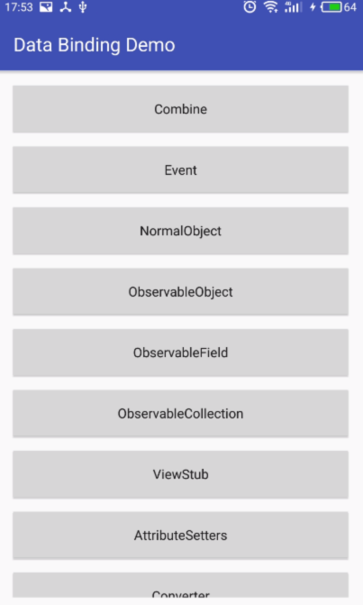

# Android Data Binding Study

## Note

1. [Powerful BindingAdapter](./note/powerful-binding-adapter.md)
1. [Super Simple and Easy to Use MultiTypeAdapter by Databinding](./note/multi-type-adapter.md)

## Demo

 
