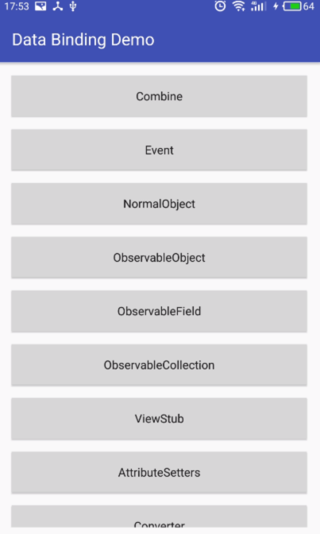

# Android Data Binding Study Note

## 1. 参考：

1. [官方文档](https://developer.android.com/topic/libraries/data-binding/index.html)
1. [中文翻译 (connorlin)](http://connorlin.github.io/2016/07/02/Android-Data-Binding-%E7%B3%BB%E5%88%97-%E4%B8%80-%E8%AF%A6%E7%BB%86%E4%BB%8B%E7%BB%8D%E4%B8%8E%E4%BD%BF%E7%94%A8/)
1. [Realm](https://realm.io/cn/news/data-binding-android-boyar-mount/)

## 2. 笔记与总结

在使用 ReactNative 完成了两个项目之后，再回过头来看 android 的 data-binding 框架，理解起来就简单多了。我觉得上面参考的三篇文章就足够了。看了 github 上的一些 demo 例子，我觉得 [connorlin 的例子](https://github.com/ConnorLin/DataBindingDemo)代码是写得最好的，用法完整，代码也非常规范，所以我基本就是把他的代码重写了一遍来学习 data-binding。

demo 效果：

[项目地址](https://github.com/baurine/android-data-binding-study)

基本的用法我就赘述了，上面的参考文章和代码已经都很详细了，我觉得这个框架最强大的两个地方是，可以用极简单地方式实现多类型 viewholder 的 recyclerview adapter，我额外写了[一篇文章](./multi-type-adapter.md)；其二就是 BindingAdpater 注解。

在传统的方式下，如果我们想为一个已存在的 View 额外添加一个自定义属性，首先这是做不到的，其次我们一般会通过继承这个 View 来实现，而且还需要在 attrs.xml 中声明 declare-styleable，一个字，麻烦。而用 BindingAdpater 可以轻易的做到，不需要派生一个新的 View，也不需要声明 declare-styleable。以在 TextView 上扩展一个自定义的 font 属性为例，只需要几行代码即可，如下所示：

    public class BindingUtil {
        // 为 TextView 增加 app:font 属性
        // 无须手动调用此函数
        @BindingAdapter("font")
        public static void setFont(TextView textView, String fontName) {
            // FontFamily 是一个自己实现的工具类
            textView.setTypeface(FontFamily.getInstance().getFont(fontName, textView.getContext()));
        }
    }

    // use in xml
    <TextView
        android:layout_width="match_parent"
        android:layout_height="wrap_content"
        android:text="@{@string/zhuanti}"
        app:font='@{"zhuanti"}'/>

首先，BindingAdpater 注解的方法必须是一个静态方法，而且不需要手动调用，由 data-binding 框架在满足条件的情况下自动调用，可以定义在任意地方，为方便管理，可以将所有的 BindingAdapter 注解的方法统一定义在一个工具类中。其次，它的方法名是可以任意的，关键在于它的参数，第一个参数必须是你要将这个属性扩展到的 View 上，如上例中，我们想把 font 属性扩展到 TextView 上，因此第一个参数就必须是 TextView 类型，后面的参数与 BindingAdapter 注解的参数一一对应，如上例中，BindingAdpater 中只有一个参数 font，我们希望这个 font 属性是 String 类型的，因此第二个参数指定为 String 类型，这样我们在 xml 中使用 app:font 时，就必须接收 String 类型，如果定义为 Integer 类型，那么在 xml 中就必须接收 Integer 类型，所以这完全取决于你的需求。

这让我想起，这个功能非常像 c#/swift/ruby 这些语言，可以直接在已有的类上扩展新的方法。尤其和 c# 的扩展方法极其相似。c# 的扩展方法，也必须是一个静态方法，第一个参数必须是要扩展的类类型。

如果需要多个属性同时存在才生效，比如为 ImageView 增加 imageUrl 和 error 属性，定义如下：

    // 无须手动调用此函数
    // 当 xml 中 ImageView 的 imageUrl 和 error 属性同时存在时，会自动调用 loadImage 函数
    @BindingAdapter({"imageUrl", "error"})
    public static void loadImage(ImageView imgView, String url, Drawable error) {
        Glide.with(imgView.getContext()).load(url).error(error).into(imgView);
    }

    // use in xml
    <ImageView
        android:layout_width="200dp"
        android:layout_height="300dp"
        app:error="@{@drawable/ic_launcher}"
        app:imageUrl="@{url}"/>

我们希望 imageUrl 属性是 String 类型，error 属性是一个 Drawable，因为函数的第一个参数是扩展对象 ImageView，第二个参数是 imageUrl 对应的 String 类型，第三个参数是 error 对应的 Drawable 类型。

使用 BindingAdapter 为 View 添加自定义属性时，不仅可以添加到自定义命名空间，也可以直接添加到 android 命名空间，两者功能上没有任何区别，只是添加到 android 命名空间时，必须加上 `android:` 前缀，而自定义命名空间可以省略，如上面的 font, imageUrl, error 在定义时都没有加 `app:` 前缀。比如我们想为所有的 View 添加一个 `android:padddingVertical` 的属性。代码如下所示：

    // 自定义属性可以添加在 android 命名空间上
    @BindingAdapter("android:paddingVertical")
    public static void setPaddingVertical(View view, int paddingVertical) {
        view.setPadding(view.getPaddingLeft(),
            paddingVertical,
            view.getPaddingRight(),
            paddingVertical);
    }

    // use in xml
    <View
        android:layout_width="wrap_content"
        android:layout_height="wrap_content"
        android:paddingVeritcal="@{200}"/>

有一点要注意，使用 BindingAdapter 定义的属性，在 xml 中使用时，只能用 "@{}" 的形式进行赋值，而不能直接使用传统方式赋值，比如上面定义的 `android:paddingVeritcal` 属性，在 xml 中使用 `android:paddingVeritcal="200dp"` 赋值时，编译就不会通过，因为这种赋值方式跟 databinding 没有任何关系啊。

使用 BindingAdapter 不仅可以为 View 添加自定义属性，而且可以改变原来存在的属性。这里举个不是那么有实际价值的例子，重新定义 TextView 的 android:text 属性，使它的内容全部大写，如下所示，注意 xml 中两种用法的区别：

    @BindingAdapter("android:text")
    public static void setText(TextView textView, String text) {
        textView.setText(text.toUpperCase());
    }

    // 仍然显示 textview
    <TextView
        android:layout_width="wrap_content"
        android:layout_height="wrap_content"
        android:text="textview"/>
    // 显示 TEXTVIEW
    <TextView
        android:layout_width="wrap_content"
        android:layout_height="wrap_content"
        android:text="@{`textview`}"/>

当使用 BindingAdapter 重新定义原来存在的属性时，在 xml 中必须使用 "@{}" 赋值才会使用新的方法，否则还是用原来的实现方法。因此，这里有一种很有趣的用法，当我想让 TextView 显示原始的字符时，就用原来的赋值方法，当想让它显示全部大写的字符时，就用 "@{}" 的赋值方法，是不是很酷。

然后我想说一下改变数据时刷新 UI，从上面的文章来看，想要改变数据时 UI 也同步更新，似乎是必须使用 ObservableObject 或 ObservableField，实则不然，直接用原始的 data model 就行，如下所示：

    // xml, activity_profile.xml
    <layout>
      <data>
        <variable name="user"
                  type="User"/>
      </data>
      <TextView
        android:layout_width="wrap_content"
        android:layout_height="wrap_content"
        android:text="@{user.age}
        android:onClick="onClick"/>
    </layout>

    // user.java
    public class User {
        private String name;
        private int age;

        public User(String name, int age) {
            this.name = name;
            this.age = age;
        }

        public int getAge() {
            return age;
        }

        public void incAge() {
            age++;
        }
    }

    // activity, ProfileActivity.java
    private ActivityProfileBinding binding;
    private User user;
    
    @Override
    protected void onCreate(Bundle savedInstaceState) {
        super.onCreate(savedInstaceState);

        binding = DataBindingUtil.setContentView(this, R.layout.activity_profile);
        user = new User("Google", 17);
        binding.setUser(user);
    }

    public void onClick(View view) {
        // 更新数据
        user.incAge();
        // 手动让 binding 重新绑定数据，从而使 UI 更新
        binding.setUser(user);
    }

更新数据后，通过手动让 activity binding 重新绑定数据，从而使 UI 得到更新。这种方式相比使用 ObservableObject 和 ObservableField，有利有弊，利的地方是你的 model 不用去继承 BaseObservale, 或者用 ObservableField<> 去 wrap 你的原始数据。弊的地方是，因为你需要操作 activity binding 重新绑定新的数据，所以你要持有这个 activity binding 对象，而 ObservableObject/ObservableField 不需要，其次这种方式是一种全局刷新，而 ObservableObject/ObservableField 是局部刷新，效率上会低一点。这两种方式让我分别联想到了 react 的 setState() 方法和 mobx (并不是说他们有一样的原理，只是感觉上很相似)。

最后，我想把 android 的这个 data-binding 和 react/vue 做一下对比。对于 react，我觉得可以理解为先有 data，后有 view，view 是依赖 data 构建出来的；而 vue，它是一种模板语言，先有 view，然后在 view 中填充数据。从这一点上来说，android 的这套 data-binding 是和 vue 更相似的，但它的灵活性不仅不如 vue，更不如 react。

正如 android 知名博主 markzai 在[他的文章](http://blog.zhaiyifan.cn/2016/06/16/android-new-project-from-0-p7/)中说道：

> 我司在新的产品中就全面使用了Data Binding技术，无论是我，还是新来直接面对Data Binding上手的工程师也好，都对其爱不释手，用惯了后简直停不下来。

我对此的看法是感同身受。

（以上所有都只是我的个人看法，并不代表是正确的。）