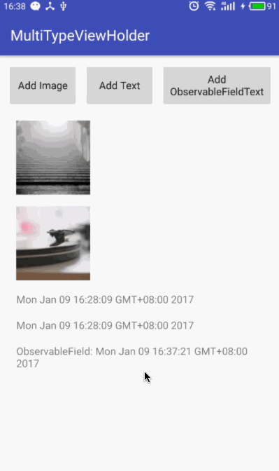

# Super Simple and Easy to Use MultiTypeAdapter by Databinding

这里阐述一种利用 android data-binding 框架来实现一个极简且极其易用的多类型 viewholder recyclerview adapter。代码只有数十行，仅一个 java 文件。理解它需要有 android data-binding 的基础知识。

先看一下 demo 效果：

[项目地址](https://github.com/baurine/android-data-binding-study)

adapter 的代码如下：

    public class MultiTypeAdapter extends RecyclerView.Adapter<MultiTypeAdapter.DataBoundViewHolder> {

        private List<IItemType> items = new ArrayList<>();

        @Override
        public DataBoundViewHolder onCreateViewHolder(ViewGroup parent, int viewType) {
            return DataBoundViewHolder.create(parent, viewType);
        }

        @Override
        public void onBindViewHolder(DataBoundViewHolder holder, int position) {
            holder.bindTo(items.get(position));
        }

        @Override
        public int getItemViewType(int position) {
            return items.get(position).getType();
        }

        @Override
        public int getItemCount() {
            return items.size();
        }

        // you can inherit MultiTypeAdapter then to implement more methods,
        // such as setItems(), addItem(index, item),
        // removeItem()...
        public void addItem(IItemType item) {
            items.add(0, item);
            notifyDataSetChanged();
        }

        ////////////////////////////////////////////////////////
        // item
        public interface IItemType {
            // should directly return layout id
            int getType();
        }

        ////////////////////////////////////////////////////////
        static class DataBoundViewHolder extends RecyclerView.ViewHolder {
            private ViewDataBinding binding;

            static DataBoundViewHolder create(ViewGroup parent, int viewType) {
                ViewDataBinding binding =
                        DataBindingUtil.inflate(LayoutInflater.from(parent.getContext()),
                                viewType, parent, false);
                return new DataBoundViewHolder(binding);
            }

            DataBoundViewHolder(ViewDataBinding binding) {
                super(binding.getRoot());
                this.binding = binding;
            }

            void bindTo(Object obj) {
                binding.setVariable(BR.item, obj);
                binding.executePendingBindings();
            }
        }
    }

能够实现动态绑定的关键点在于这个函数：

    void bindTo(Object obj) {
        binding.setVariable(BR.item, obj);
        binding.executePendingBindings();
    }

## 如何使用？

从上面的代码可以看到，要使用这个 adapter，只有两个限制：

1. adapter 中的 item 必须实现 IItemType 接口，而 IItemType 只有一个 getType() 方法，这个方法应该返回此 item 的 layout id；
1. 在 xml 中使用时，variable 的名字必须是 item，不能是其它名字。当然你也可以改写 ITtemType 接口，增加一个 getVariableId() 的方法，使之更灵活，但我觉得没有必要为了增加这种微小的灵活性而牺牲其简约性。这取决于你是喜欢“约定大于配置”，还是“配置大于约定”。如果你想要这么做，那么下面是示例代码：

        // 为 IItemType 接口增加新方法
        public interface IItemType() {
            int getType();
            int getVariableId();
        }

        // 修改 bindTo 方法
        void bindTo(IItemType item) {
            binding.setVariable(item.getVariableId(), item);
            binding.executePendingBindings();
        }

下面我以实现上面的 demo 为例子详细描述一下如何使用。

我们想显示两种类型的数据，一种是图片，定义为 ImageItem，显示在 `item_image.xml` layout 上，另一种为文字，定义为 TextItem，显示在 `item_text.xml` layout 上。ImageItem 和 TextItem 需要实现 IItemType 接口，代码如下：

    // ImageItem，必须实现 IItemType 接口
    public class ImageItem implements MultiTypeAdapter.IItemType {
        @Override
        public int getType() {
            return R.layout.item_image;
        }

        private final String url;

        public ImageItem() {
            url = "https://unsplash.it/100/100?random&r=" + new Random().nextInt();
        }

        public String getUrl() {
            return url;
        }
    }

    // TextItem，必须实现 IItemType 接口
    public class TextItem implements MultiTypeAdapter.IItemType {
        @Override
        public int getType() {
            return R.layout.item_text;
        }

        private String text;

        public TextItem() {
            text = (new Date()).toString();
        }

        public String getText() {
            return text;
        }
    }

    // item_image.xml, variable 的 name 必须是 item
    // ImageView 的 error/imageUrl/placeholder 属性是用 BindingAdapter 注解实现的
    <data>
        <variable
            name="item"
            type="com.baurine.multitypeviewholder.item.ImageItem"/>
    </data>

    <ImageView
        android:layout_width="100dp"
        android:layout_height="100dp"
        app:error="@{@drawable/ic_launcher}"
        app:imageUrl="@{item.url}"
        app:placeholder="@{@drawable/ic_launcher}"/>

    // item_text.xml，variable 的 name 必须是 item
    <data>
        <variable
            name="item"
            type="com.baurine.multitypeviewholder.item.TextItem"/>
    </data>

    <TextView
        android:layout_width="wrap_content"
        android:layout_height="wrap_content"
        android:text="@{item.text}"/>

然后我们加上两个按钮的点击事件：

    // MainActivity.java
    public void onClick(View view) {
        switch (view.getId()) {
            case R.id.btn_add_image:
                adapter.addItem(new ImageItem());
                break;
            case R.id.btn_add_text:
                adapter.addItem(new TextItem());
                break;
            default:
                break;
        }
    }

That's all。如果你的 adapter 只是用来展示，不需要任何点击事件，这就足够了。这时候 adapter 中的 item 就如以往一样，是一个简单的 data model，只包含数据。

然而大部分的 adapter 还是需要点击事件的，这时候你可能会疑惑，上面的 adapter 并没有暴露任何接口可以让我们去 set click listener 之类的，那怎么处理事件呢，我们不是还有 item 吗？item 不仅可以包含数据，也可以包含事件处理的方法。所以这就是为什么我没有把 ImageItem 命名为 ImageModel 的原因。在这里我不把它作为是一个简单的 data model，而是一个 wrapper，用来 wrap 原始数据和事件处理方法，或者你也可以把这个理解为一种 "Fat Model"。从此，你的重心将不再是实现一个又一个的 adapter 和 viewholder，你可以忘掉 adapter 和 viewhoder 了，将重心转移到实现一个又一个的 item 上。

我们继续来演示一下，比如我们想让 `item_image.xml` 中的 ImageView 点击时，用 toast 显示自己的 url。代码如下：

    // ImageItem.java
    // 增加 onClick 事件处理方法
    public void onClick(Context cxt) {
        Toast.makeText(cxt, url, Toast.LENGTH_SHORT).show();
    }

    // item_image.xml
    // 为 ImageView 添加点击事件
    // android:onClick="@{()->item.onClick(context)}"
    <ImageView
        android:layout_width="100dp"
        android:layout_height="100dp"
        android:onClick="@{()->item.onClick(context)}"
        app:error="@{@drawable/ic_launcher}"
        app:imageUrl="@{item.url}"
        app:placeholder="@{@drawable/ic_launcher}"/>

我们想让 `item_text.xml` 中的 TextView 点击时，更新文本内容。更新文本内容后必须刷新 UI，要调用 adapter.notifyDataSetChanged()，所以 TextItem 必须得持有 adapter 对象，因此我们修改代码如下：

    // TextItem.java
    public TextItem(MultiTypeAdapter adapter) {
        text = (new Date()).toString();
        this.adapter = adapter;
    }

    // 更新数据
    public void updateText() {
        text = (new Date()).toString();
        adapter.notifyDataSetChanged();
    }

    // item_text.xml
    // 为 TextView 增加点击事件
    // android:onClick="@{()->item.updateText()}"
    <TextView
        android:layout_width="wrap_content"
        android:layout_height="wrap_content"
        android:onClick="@{()->item.updateText()}"
        android:text="@{item.text}"/>

这样就可以了。

我们还可以进一步，我们如果用 ObservableField 或 ObservableObject 来实现 Item 中的数据部分，那么当数据发生改变时，我们根本无须手动调用 adapter.notifyDataSetChanged，UI 就会自动刷新，因此像上例中的 item 就无须持有 adapter 对象了。我在项目中仅示例了 ObservableField 的例子，你们可以自己尝试一下 ObservableObject。代码如下：

    public class ObservableFiledTextItem implements MultiTypeAdapter.IItemType {
        @Override
        public int getType() {
            return R.layout.item_observable_filed_text;
        }

        ////////////////////////////////////////////////
        // data model part
        public ObservableField<String> text = new ObservableField<>();

        public ObservableFiledTextItem() {
            updateText();
        }

        ////////////////////////////////////////////////
        // event handle part
        public void updateText() {
            text.set("ObservableField: " + (new Date()).toString());
        }
    }

效果如下所示：

另外，我发现很多人在去实现这种通用 adapter 时，都会很纠结 recyclerview 怎么没有 listview 所拥有的 OnItemClickListener，于是硬是要去给这个 adapter 塞一个 OnItemClickListener，我觉得这是没有理解 recyclerview 为什么要去掉它。因为对于一个复杂的 item layout 来说，我需要给这个 item layout 上不同的 view 响应不同的点击事件，比如一个 Feed 流中的 Card，有点赞的按钮，有评论的按钮，OnItemClickListener 就完全不够用了，如果你确实只想要 OnItemClickListener 的效果，你就只给最外层的 View 加上点击事件不就行了吗，跟 item layout 上任意一个 view 添加点击事件是没有区别的，OnItemClickListener 没有完全单独存在的必要。
